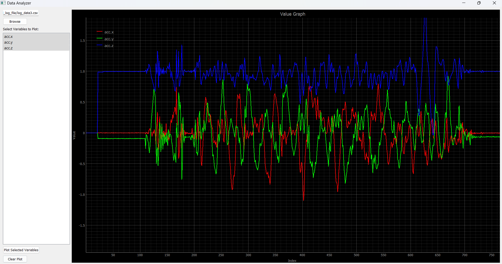

# CSV Data Analyzer

A simple and intuitive CSV Data Analyzer built with Python and PyQt5. This tool allows users to load CSV files, select specific variables to plot, zoom into areas of interest, and compare multiple variables on a single graph. 



> **Note**: The image above shows the main interface of the CSV Data Analyzer.

## Features
- **CSV File Loading**: Browse and select CSV files directly from the interface.
- **Variable Selection**: Choose specific columns/variables (integer or float) from the CSV to plot.
- **Multi-variable Plotting**: Plot multiple variables on a single graph with distinguishable colors.
- **Interactive Plot Controls**:
  - **Mouse Wheel Zoom**: Zoom in and out with the mouse wheel or two-finger scroll on the touchpad.
  - **Horizontal/Vertical Stretching**: Right-click and drag to stretch the graph horizontally or vertically.
  - **Panning**: Left-click and hold, then move the mouse to pan the graph.
- **Grid Lines**: Displayed for better readability of the plot.

## Installation

### Requirements
- Python 3.6+
- [PyQt5](https://pypi.org/project/PyQt5/)
- [PyQtGraph](https://pypi.org/project/pyqtgraph/)
- [Pandas](https://pypi.org/project/pandas/)

### Steps
1. Clone this repository:
   ```bash
   git clone https://github.com/amitx64/csv-data-analyzer.git
   cd csv-data-analyzer
   ```
2. Install the required packages:
   ```bash
   pip install -r requirements.txt
   ```

## Usage
1. Run the application:
   ```bash
   python data_analyzer.py
   ```
2. The GUI will open with options to:
   - **Browse** for a CSV file to load.
   - **Select Variables** to plot from the left-hand panel.
   - **Plot, Clear, and Zoom** the data directly from the interface.

### Controls
- **Load CSV**: Use the “Browse” button to locate your CSV file, and the variables will populate in the selection list.
- **Select Variables**: Check multiple variables to plot them on the same graph with unique colors.
- **Plot Navigation and Zoom**:
  - **Zoom**: Use the mouse wheel or two-finger scroll to zoom in and out.
  - **Stretch**: Right-click and drag to horizontally or vertically stretch the plot.
  - **Pan**: Left-click and drag to move the plot around.
- **Clear Plot**: Reset the plot to remove all data.

### Example
- Ensure your CSV file has a `timestamp` column (or another primary column for the X-axis) and additional columns with numerical data.
- Remaining columns should contain numeric data (integer or float) for plotting.

## File Structure
```
csv-data-analyzer/
├── data_analyzer.py                # Main application code
├── sample_data.csv                 # Sample CSV data for testing
├── README.md                       # Project documentation
└── images/
    └── application_screenshot.png  # Screenshot of the application
```

## Example Data Format
Make sure your CSV files have a structure similar to the one below:

| timestamp | variable1 | variable2 | variable3 |
|-----------|-----------|-----------|-----------|
| 0         | 5.6       | 3.2       | 7.4       |
| 1         | 5.8       | 3.4       | 7.5       |
| 2         | 5.9       | 3.6       | 7.8       |

## Contributing
1. Fork this repository.
2. Create a new branch (`feature/your-feature`).
3. Commit your changes (`git commit -m 'Add new feature'`).
4. Push to the branch (`git push origin feature/your-feature`).
5. Open a pull request.

Contributions are welcome! Please ensure your code is well-documented.

## License
This project is licensed under the MIT License. See the [LICENSE](LICENSE.txt) file for details.

